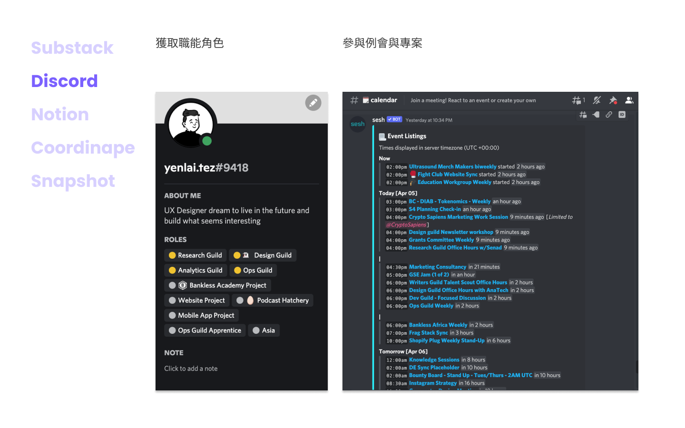
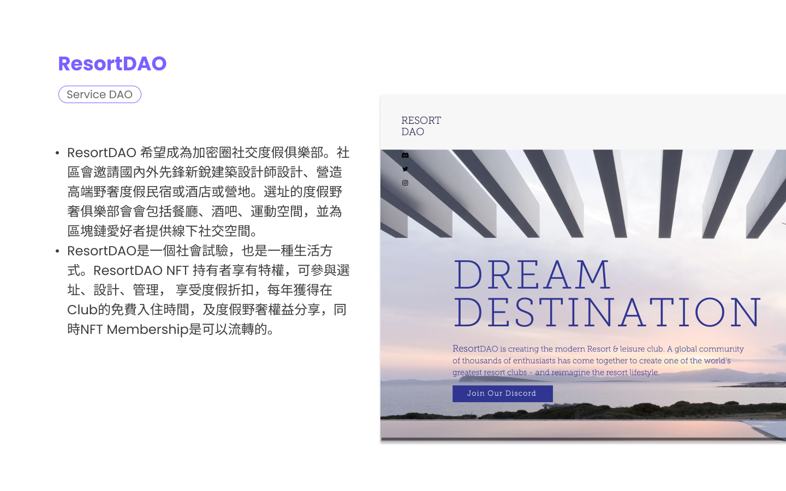

# DAO 101

An internal sharing of The Introduction of DAO in Ogilvy. I shared my experience joining in Bankless's work building an education platform, Bankless Academy, in 2021. 

Slides are listed as below.

